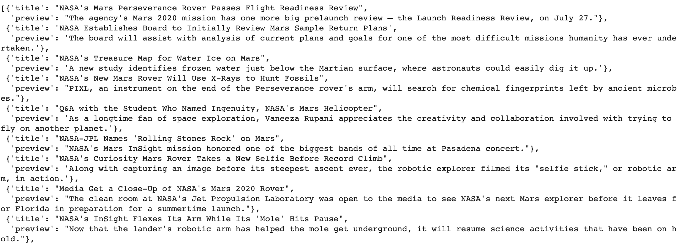
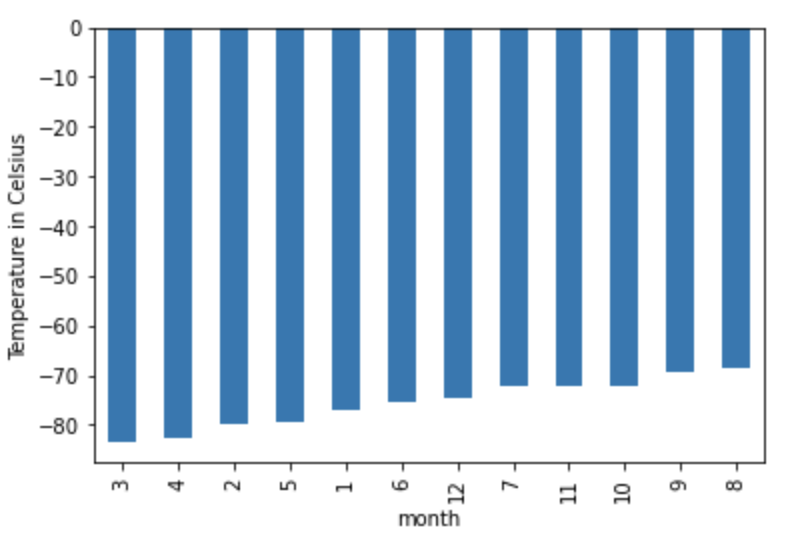
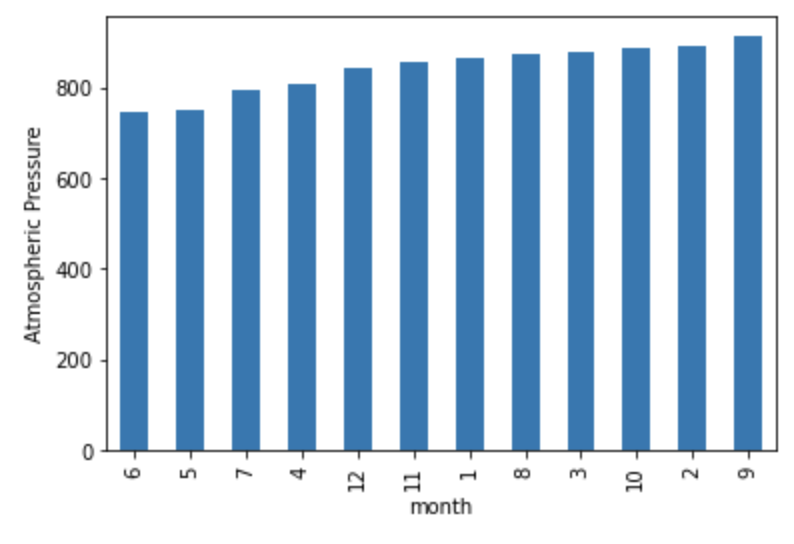
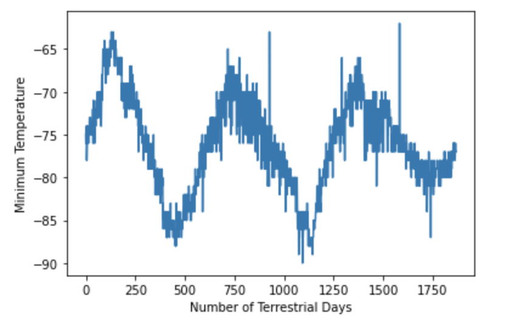

# Mission to Mars

Analysis done to data extracted from NASA Mars News and data stored in Amazon Web Services as a table. 

## Web scrapping on Mars news articles

An automatic way to follow which topics are the latest on news for Mars, a HTML code extracted from the NASA served to create a list of news articles that are recent. This data could be used to identify which updates are on the findings in our neighbor planet. The information requested could be simply put in a dictionary format to easy read, as shown in the picture. 

## Analyze weather data

Web scrapping also allows to extract information from different formats, table format is one of them and its best used to display information on a website. 

Parsing through the data and collecting to retrive useful insights that could be plotted on the different attributes, such as: weather conditions and Terrestrial Days.

From the temperature and atmosferic pressure, it can be seen that the values represent very harsh conditions, with temperatures being as cold as -80 Celsius and pressures beign greater than 750 times that the one found on Earth at sea level.  

The days on Mars are very different, even though there is an apparent 12 months pattern similar to Earth, the time it represents appears to be way more. From the picture it can be seen that an average distance for the temperature change is of magnitude close to ~650 days, that could be attributed as a lap of a year.
